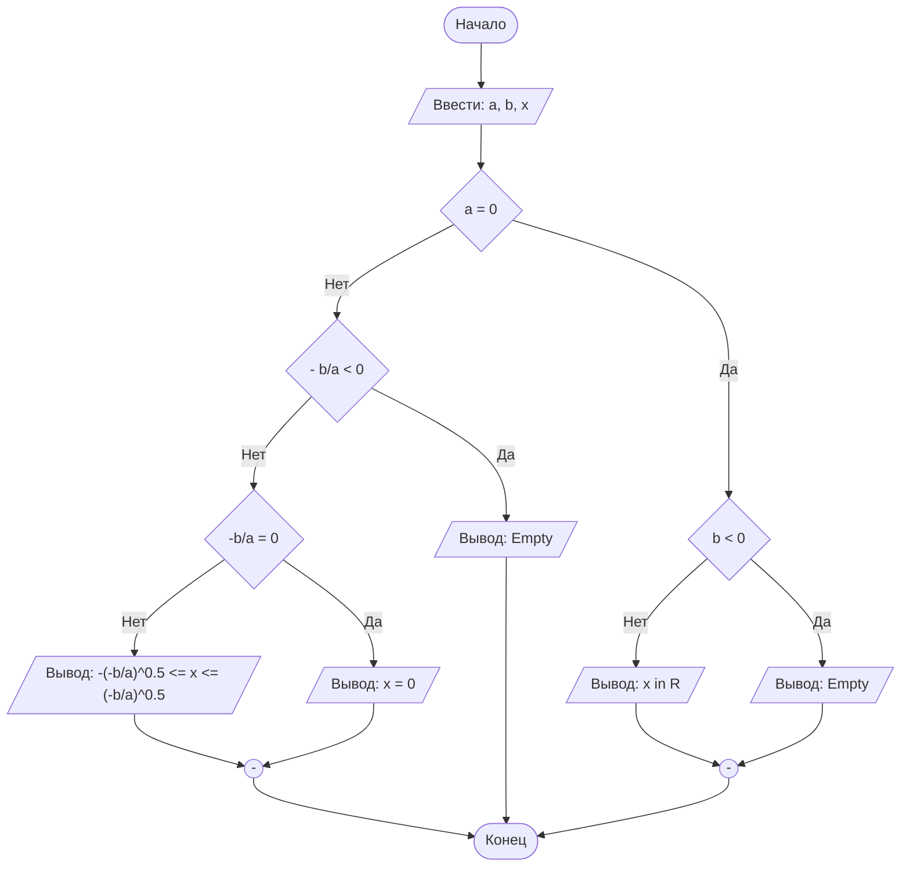

## Отчет по лабораторной работе № 1

#### № группы: `ПМ-2602`

#### Выполнила: `Митрофанова Дарья Владиславовна`

#### Вариант: `13`

### Cодержание:

- [Постановка задачи](#1-постановка-задачи)
- [Входные и выходные данные](#2-входные-и-выходные-данные)
- [Математическая модель](#25-математическая-модель)
- [Выбор структуры данных](#3-выбор-структуры-данных)
- [Алгоритм](#4-алгоритм)
- [Программа](#5-программа)
- [Анализ правильности решения](#6-анализ-правильности-решения)

### 1. Постановка задачи

- Условия задачи

> Набор бусинок диаметрами A, B, C, D, надетый на нить, пытаются протащить в указанном порядке через отверстие диаметром X. Какое количество бусинок удастся протащить через отверстие? На вход программы подаются натуральные числа X, A, B, C, D.

- Для решения данной задачи нужно написать программу, которая на выводе предоставит информацию о том, сколько из четырёх бусин способно пройти через отверстие. Бусина проходит через отверстие тогда и только тогда, когда она строго меньше отверстия. Если же она больше или равна диаметру отверстия - проход осуществить невозможно. Так как все бусины связаны и заданы в определённом порядке, при непрохождении, например, бусины А, остальные пройти не смогут в независимости от того, какого они диаметра. Соответственно, для решения задачи мы должны перебрать бусины в строго указанном порядке и, если бусина индекса n не проходит, зафиксировать счётчик на n-1.  

### 2. Входные и выходные данные

На вход программы подаются пять натуральных чисел:
`X A B C D`

#### Диаметр отверстия X:

Тип данных: целочисленный

Количество: одно число

Нижняя граница: X ≥ 1

Верхняя граница: в условии задачи не указана, однако, с учётом того, что мы используем тип данных int, значение не может быть больше, чем 2³¹-1.

#### Диаметр первой бусины A:

Тип данных: целочисленный

Количество: одно число

Нижняя граница: A ≥ 1

Верхняя граница: в условии задачи не указана

#### Аналогичные параметры будут использоваться для диаметров B, C, D соответственно. 

#### На выход выводится одно натуральное число N — количество бусинок, которые удалось протащить через отверстие.

Тип результата: целочисленный

Количество: одно число

Нижняя и верхняя границы (диапазон): 0 ≤ N ≤ 4

Диапазон обусловлен количеством бусин на вводе - их всего четыре, значит, итоговое количество прошедших бусин не может быть больше четырёх. 

### 2,5. Математическая модель

Математическая модель для данной задачи не требуется.

### 3. Выбор структуры данных

Для хранения данных, нужных для работы программы, специальная структура данных не требуется. Будет достаточным использование пяти целочисленных переменных суммарно (четыре для входных данных, одну - для вывода).

### 4. Алгоритм

Программа последовательно сравнивает диаметр отверстия и бусины и, если бусина n оказывается больше или равной отверстию, фиксирует счётчик N на значении n - 1.

Сравниваем диаметр первой бусины A с диаметром отверстия X.

Если A ≥ X, первая бусина не проходит, N = 0

Иначе первая бусинка проходит

Сравниваем B с X

Если B ≥ X, N = 1

Иначе проходят две бусины - A и B

Сравниваем C с X

Если C ≥ X, N = 2

Иначе проходят три бусины - A, B и С

Сравниваем D с X

Если D ≥ X, N = 3

Иначе проходят все четыре бусинки, N = 4


```markdown
    ```mermaid
        ([Начало]) --> B[/Ввести: a, b, x/]
        B --> C{a = 0}
        C -- Нет --> D{- b/a < 0}
        D -- Нет --> E{"-b/a = 0"}
        E -- Нет --> F[/"Вывод: -(-b/a)^0.5 <= x <= (-b/a)^0.5"/]
        E -- Да --> G[/Вывод: x = 0/]
        D -- Да --> H[/Вывод: Empty/]
        C -- Да --> I{b < 0}
        I -- Нет --> J[/Вывод: x in R/]
        I -- Да --> K[/Вывод: Empty/]
        J --> M(("-"))
        K --> M
        G --> L(("-"))
        H ----> Z
        F --> L
        M --> Z
        L --> Z([Конец])
    ``` 
```




`Mermaid` нативно интегрирован в `GitHub`, а для работы в Вашей среде разработке - нужно установить
плагин: `File` > `Settings` > `Plugins`.


### 5. Программа

Полный текст программы с комментариями на русском языке

Нужно вставить код прямо в отчет в блок:

```markdown
    ```java
        class Main{
            // Что-то далее
        }
    ``` 
```

Это будет выглядеть следующим образом:

```java
class Main{
    // Что-то далее
}
```

### 6. Анализ правильности решения

Привести тесты и анализ работы программы для этих тестов.
Очень неплохо было бы обосновать выбор тестов.

1. Тест на что-то

- Input:
    ```
    1
    1
    ```

- Output:
    ```
    2
    ```

2. Тест на что-то еще

- Input:
    ```
    1
    -1
    ```

- Output:
    ```
    0
    ```
