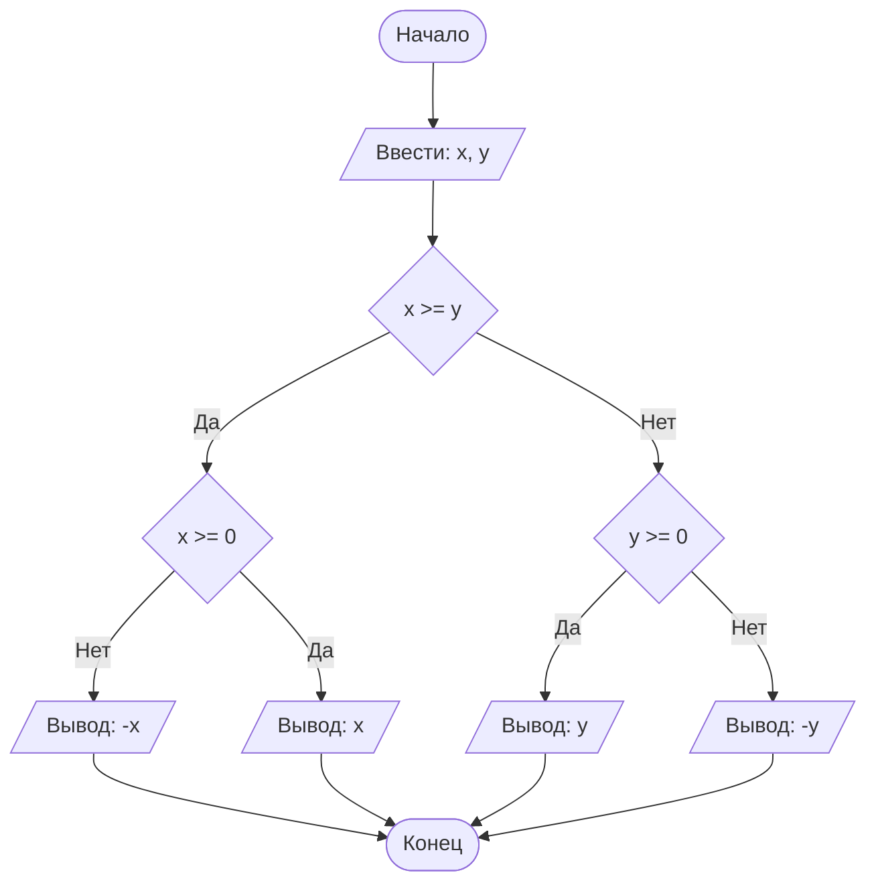

## Отчет по лабораторной работе № 1

#### № группы: `ПМ-2602`

#### Выполнила: `Митрофанова Дарья Владиславовна`

#### Вариант: `13`

### Cодержание:

- [Постановка задачи](#1-постановка-задачи)
- [Входные и выходные данные](#2-входные-и-выходные-данные)
- [Выбор структуры данных](#3-выбор-структуры-данных)
- [Алгоритм](#4-алгоритм)
- [Программа](#5-программа)
- [Анализ правильности решения](#6-анализ-правильности-решения)

### 1. Постановка задачи

- Условия задачи

> Набор бусинок диаметрами A, B, C, D, надетый на нить, пытаются протащить в указанном порядке через отверстие диаметром X. Какое количество бусинок удастся протащить через отверстие? На вход программы подаются натуральные числа X, A, B, C, D.

- Для решения данной задачи нужно написать программу, которая на выводе предоставит информацию о том, сколько из четырёх бусин способно пройти через отверстие. Бусина проходит через отверстие тогда и только тогда, когда она строго меньше отверстия. Если же она больше или равна диаметру отверстия - проход осуществить невозможно. Так как все бусины связаны и заданы в определённом порядке, при непрохождении, например, бусины А, остальные пройти не смогут в независимости от того, какого они диаметра. Соответственно, для решения задачи мы должны перебрать бусины в строго указанном порядке и, если бусина индекса n не проходит, зафиксировать счётчик на n-1.  

### 2. Входные и выходные данные

#### Данные на вход

На вход программа должна получать 5 чисел, при этом в условии сказано, что они принадлежат множеству натуральных чисел. Нижняя и верхняя граница чисел по условию не заданы.

|             | Тип                         | min значение  | max значение   |
|-------------|-----------------------------|---------------|----------------|
| X (Число 1) | Целое неотрицательное число | 1             | не задано      |
| A (Число 2) | Целое неотрицательное число | 1             | не задано      |
| B (Число 3) | Целое неотрицательное число | 1             | не задано      |
| C (Число 4) | Целое неотрицательное число | 1             | не задано      |
| D (Число 5) | Целое неотрицательное число | 1             | не задано      |

#### Данные на выход

Т.к. программа должна вывести количество бусин, прошедших через отверстие, то на выход мы получим
единственное целое неотрицательное число, не превышающее 4, т.к. на вход подаются диаметры четырёх бусин, следовательно, количество прошедших через отверстие не может превышать 4.

|         | Тип                                | min значение | max значение   |
|---------|------------------------------------|--------------|----------------|
| Число 1 | Целое неотрицательное число        | 0            | 4              |


### 3. Выбор структуры данных

Программа получает 5 целых чисел. Поэтому для их хранения
можно выделить 5 переменных (`holeDiameterX`, `beadDiameterA`, `beadDiameterB`, `beadDiameterC`, `beadDiameterD`) типа `int`.

|             | название переменной             | Тип (в Java) | 
|-------------|---------------------------------|--------------|
| X (Число 1) | `holeDiameterX`                 | `int`        |
| A (Число 2) | `beadDiameterA`                 | `int`        |
| B (Число 2) | `beadDiameterB`                 | `int`        |
| C (Число 2) | `beadDiameterC`                 | `int`        |
| D (Число 2) | `beadDiameterD`                 | `int`        |

Для вывода результата выделим одну переменную (`N`) типа `int`.

|             | название переменной             | Тип (в Java) | 
|-------------|---------------------------------|--------------|
| N           | `N`                             | `int`        |

### 4. Алгоритм

#### Алгоритм выполнения программы:

1. **Ввод данных:**  
   Программа считывает пять целых чисел, обозначенных как `holeDiameterX`, `beadDiameterA`, `beadDiameterB`, `beadDiameterC`, `beadDiameterD`.

2. **Введение переменной для вывода:**
   Программа вводит переменную `N`, предназначенную для дальнейшей фиксации количества бусин, прошедших через отверстие.

3. **Сравнение чисел:**  
  - Программа сравнивает значения `holeDiameterX` и `beadDiameterA`. Если `holeDiameterX` меньше или равно `beadDiameterA`, программа присваивает переменной `N` значение 0. Если `holeDiameterX` больше, программа переходит к следующему сравнению `holeDiameterX` и `beadDiameterB`.
  - Если `holeDiameterX` меньше или равно `beadDiameterB`, программа присваивает переменной `N` значение 1. Если `holeDiameterX` больше, программа переходит к следующему сравнению `holeDiameterX` и `beadDiameterC`.
  - Если `holeDiameterX` меньше или равно `beadDiameterC`, программа присваивает переменной `N` значение 2. Если `holeDiameterX` больше, программа переходит к следующему сравнению `holeDiameterX` и `beadDiameterD`.
  - Если `holeDiameterX` меньше или равно `beadDiameterD`, программа присваивает переменной `N` значение 3. Если `holeDiameterX` больше, программа присваивает переменной `N` значение 4.

4. **Вывод результата:**  
   На экран выводится значение переменной `N`.

#### Блок-схема



### 5. Программа

```java
import java.util.Scanner;

public class Main {
    public static void main(String[] args) {
        Scanner sc = new Scanner(System.in);
        int holeDiameterX = sc.nextInt();
        int beadDiameterA = sc.nextInt();
        int beadDiameterB = sc.nextInt();
        int beadDiameterC = sc.nextInt();
        int beadDiameterD = sc.nextInt();
        int N;
        if (holeDiameterX <= beadDiameterA) {
            N = 0;
        } else {
            if (holeDiameterX <= beadDiameterB) {
                N = 1;
            } else {
                if (holeDiameterX <= beadDiameterC) {
                    N = 2;
                } else {
                    if (holeDiameterX <= beadDiameterD) {
                        N = 3;
                    } else {
                        N = 4;
                    }
                }
            }
        }
        System.out.print(N);
    }
}
    // Объявляем объект класса Scanner для ввода данных
    public static Scanner in = new Scanner(System.in);
    // Объявляем объект класса PrintStream для вывода данных
    public static PrintStream out = System.out;

    public static void main(String[] args) {
        // Считывание двух вещественных чисел x и y из консоли
        double x = in.nextDouble();
        double y = in.nextDouble();

        // Определение максимального числа
        if (x >= y) {
            // Если x положительное, выводим x, иначе выводим -x,
            // чтобы на выходе было его абсолютное значение
            if (x >= 0) {
                out.println(x);
            } else {
                out.println(-x);
            }
        } else {
            // Если x положительное, выводим y, иначе выводим -y,
            // чтобы на выходе было его абсолютное значение
            if (y >= 0) {
                out.println(y);
            } else {
                out.println(-y);
            }
        }
    }
}
```

### 6. Анализ правильности решения

Программа работает корректно на всем множестве решений с учетом ограничений.

1. Тест на `X > Y > 0`:

    - **Input**:
        ```
        5 1.3
        ```

    - **Output**:
        ```
        5
        ```

2. Тест на `X < Y < 0`:

    - **Input**:
        ```
        -4 -2.2
        ```

    - **Output**:
        ```
        2.2
        ```

3. Тест на `X < 0 < Y`:

    - **Input**:
        ```
        -4 5
        ```

    - **Output**:
        ```
        5
        ```

4. Тест на `X = 0` или `Y = 0`:

    - **Input**:
        ```
        0 -3
        ```

    - **Output**:
        ```
        3
        ```

5. Тест на ограничение задачи:

    - **Input**:
        ```
        -1000000000 1000000000
        ```

    - **Output**:
        ```
        1000000000
        ```
